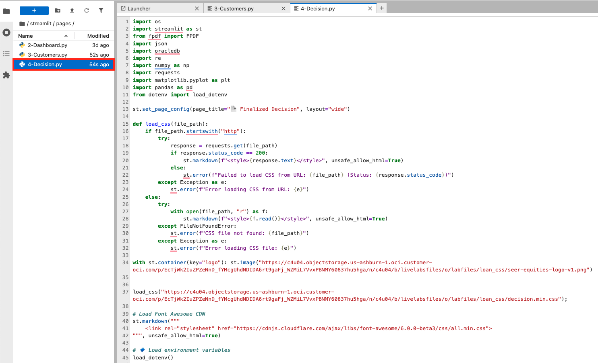
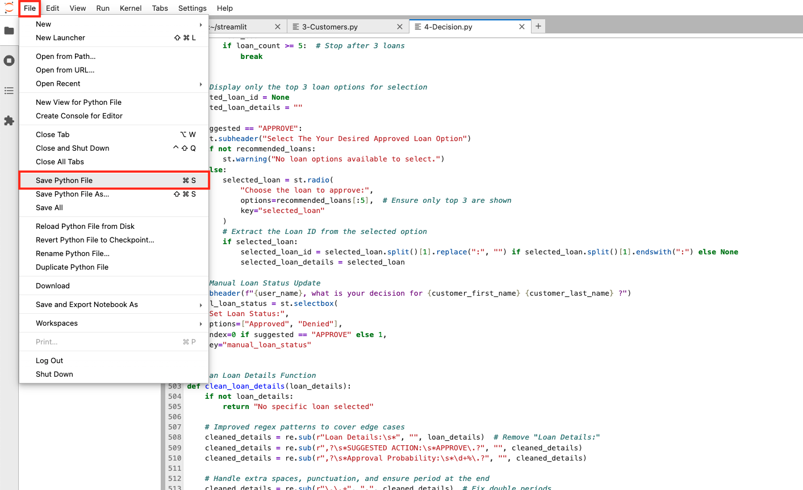

# Graph Developer Coding Exercise

## Introduction

In this lab, you will complete an Graph developer coding exercise.

Estimated Time: 30 minutes

### Objectives
* Perform the coding required to achieve the enhancement request outlined in the instructions.


### Prerequisites

This lab assumes you have:
* An Oracle Cloud account
   

## Task 1: Graph Developer Coding Exercise

**Task**:

The loan officer is requesting an additional graph to be added to the decision page to visualize additional loan options based on credit score and debt-to-income ratio. Specifically, they want to display an additional graph that shows loan options based on two key metrics: required credit score on one axis and debt-to-income ratio on the other.

**Instructions**:

1. Update the Decision.py file to add functionality for an additional graph that displays the following metrics: Required Credit Score and Debt-to-Income Ratio (%). The graph should display scatter plots similar to the example provided below, Required Credit Score and Debt-to-Income Ratio (%) are plotted:

    

2. Implement a dropdown that allows the user to select the new graph view.

    

**Guidance**:

We will show you how to access the files needed to complete the exercise and how to view the changes you make.

1. To navigate to the development environment, click **View Login Info**. Copy the Development IDE Login Password. Click the Start Development IDE link.

    

2. Paste in the Development IDE Login Password that you copied in the previous step. Click **Login**.

    

3. Click **Pages**.

    


4. Select the **Decision.py** file.

    

5. After making the necessary changes in the Decision.py file to create an additional graph that displays the following metrics: Required Credit Score and Debt-to-Income Ratio (%), you will need to save the file.

    

6. To view the changes you made, select the **Launcher** tab and open the **terminal**. 

    

7. Copy the ./run.sh command and paste it into the terminal.

    ````
    <copy>
    ./run.sh
    </copy>
    ````

8. Click the URL displayed in the terminal to launch the SeerEquities Loan Management application.

    

9. Enter in a username and click **Login**.

    

10. On the Dashboard page, from the pending review list, select the Customer ID for **James Woods**.

    

11. This will display the customers loan application details. In approximately 15 seconds, the AI generated loan recommendations will be displayed. Click the **Navigate To Decisions** button.

    

12. Expand the drop down to view the newly added graph.

    

## Learn More

*(optional - include links to docs, white papers, blogs, etc)*

* [URL text 1](http://docs.oracle.com)
* [URL text 2](http://docs.oracle.com)

## Acknowledgements
* **Author** - <Name, Title, Group>
* **Contributors** -  <Name, Group> -- optional
* **Last Updated By/Date** - <Name, Month Year>
